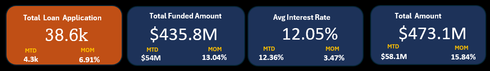
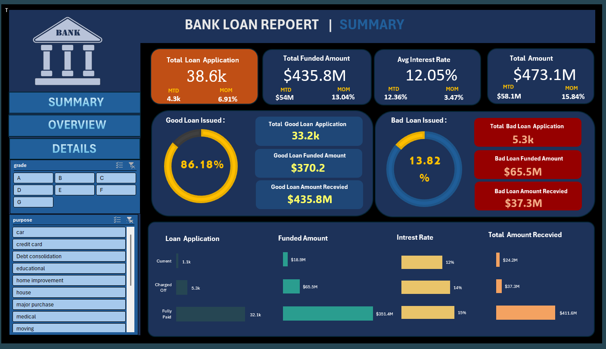
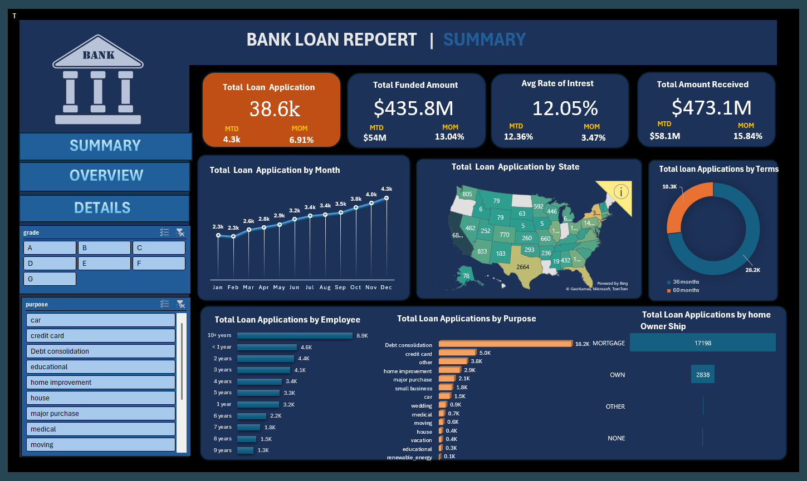

# Bank-Loan-Analysis
**Project Overview**

This project focuses on creating a comprehensive Bank Loan Report designed to monitor and assess the bank's lending activities and performance. The report provides insights into key loan-related metrics and their trends over time, enabling data-driven decisions and strategic planning within our lending operations.

Key Features

**KPIS**

**Dashboard 1: Summary**

This dashboard offers a summary view of essential Key Performance Indicators (KPIs) related to loan applications, funded amounts, received amounts, and interest rates. It includes:

Total Loan Applications:
Tracking the total number of loan applications, including Month-to-Date (MTD) and Month-over-Month (MoM) changes.

Total Funded Amount:
Monitoring the total funds disbursed, along with MTD and MoM analysis.

Total Amount Received:
Assessing the total repayments received, with MTD and MoM tracking.

Average Interest Rate: Calculating the average interest rate across loans and analyzing MoM variations.

Good Loan vs. Bad Loan KPIs

The project differentiates between 'Good Loans' (fully paid or current) and 'Bad Loans' (charged off) through 

KPIs:
Good Loan KPIs: Metrics include the percentage, total applications, funded amount, and total received amount for loans classified as 'Good Loans.'

Bad Loan KPIs: Metrics include the percentage, total applications, funded amount, and total received amount for loans classified as 'Bad Loans.'

Loan Status Grid View
A grid view report categorized by 'Loan Status' provides a detailed overview of:

Total Loan Applications, Funded Amount, Received Amount: Metrics tracked Month-to-Date (MTD) and Month-over-Month (MoM).

**DashBoard1**

**Dashboard 2: Overview**

This dashboard visualizes critical loan-related metrics and trends using various chart types:

Monthly Trends by Issue Date (Line Chart): Displays 'Total Loan Applications,' 'Total Funded Amount,' and 'Total Amount Received' over time.

Regional Analysis by State (Filled Map): Shows metrics categorized by state, highlighting regional lending activity.

Loan Term Analysis (Donut Chart): Depicts loan statistics based on term lengths (e.g., 36 months, 60 months).

Employee Length Analysis (Bar Chart): Illustrates metrics distribution among borrowers with different employment lengths.

Loan Purpose Breakdown (Bar Chart): Provides a visual breakdown of metrics by loan purpose categories.

Home Ownership Analysis (Tree Map): Displays loan metrics categorized by home ownership status.

**Dashboard2**

**Dashboard 3: Details**

The Details Dashboard consolidates all essential information into a user-friendly interface, providing a holistic snapshot of key loan metrics, borrower profiles, and loan performance.

**Conclusion**
This project provides a robust framework for analyzing and visualizing the bank's loan portfolio, enabling effective monitoring and strategic decision-making. The comprehensive dashboards and detailed reports are designed to enhance the understanding of lending trends, loan quality, and borrower behavior.

